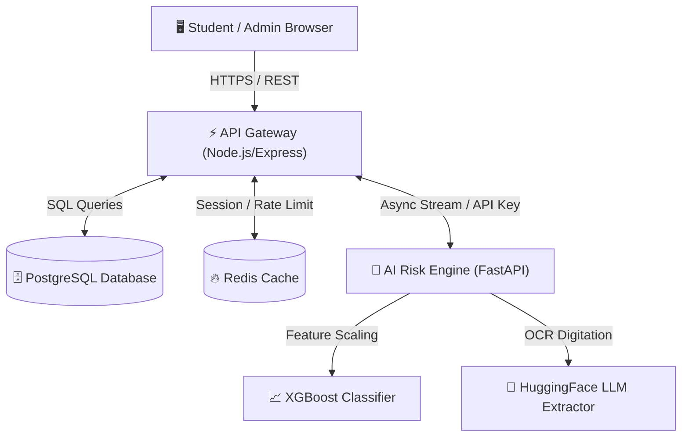

# Credixa: Comprehensive Project Analysis

## 1. Executive Summary & Problem Statement
Credixa is a next-generation Education Buy Now Pay Later (BNPL) and autonomous underwriting platform designed to address the financing gap for students who lack traditional credit histories (thin credit files). Legacy banking systems rely heavily on historical credit scores, making educational loans slow, paper-heavy, and difficult to obtain for students. Credixa solves this by leveraging an AI-driven, real-time behavioral underwriting system that analyzes non-traditional indicators—such as academic performance, savings rate, and digital footprint—instead of relying purely on conventional credit bureaus.

## 2. Comprehensive System Architecture & Design
Credixa operates on a highly scalable, microservices-oriented 5-Pillar cloud architecture.

### The 5 Pillars
1. **Frontend UI (React 19 + Vite + Tailwind CSS)**: Provides a blazing-fast, responsive interface for students, co-applicants, and institution administrators.
2. **API Gateway (Node.js + Express + JWT)**: Acts as the central nervous system. It handles user authentication, business logic, role-based access control, and acts as a secure proxy to the AI Risk Engine.
3. **AI Risk Engine (Python + FastAPI + XGBoost + LLMs)**: The intelligence layer. It performs Optical Character Recognition (OCR), text extraction from PDFs (bank statements, fee structures), and utilizes a trained XGBoost model along with HuggingFace LLMs to compute a proprietary "Omniscore".
4. **Database Vault (PostgreSQL via Supabase)**: Ensures ACID compliance and strong relational data integrity for user profiles, transaction ledgers, active loans, and audit trails.
5. **Session Cache (Redis 7)**: Provides high-speed caching for expensive LLM inference results, session state, and API rate limiting.

### Architecture Diagram

## 3. Code & Folder Structure Analysis
The repository is structured to support local microservice orchestration via Docker Compose.
* `frontend/`: Contains the React/Vite application. Uses Context API for state management and Tailwind for styling. Key components include `Onboarding.jsx`, `DocumentUpload.jsx`, and role-based dashboards.
* `backend-gateway/`: The Node.js application. Houses API routes, database models/migrations (`init.sql`), and scheduled cron jobs (`loan_scheduler.js`).
* `risk-engine/`: The Python ML service. Contains the FastAPI server, XGBoost models (`risk_model.pkl`), scalers (`scaler.pkl`), and PDF text extraction logic.
* `database/`: Schema definitions and migration scripts to build the PostgreSQL database structures (tables, ENUMs, functions, triggers).
* `docker-compose.yml`: Orchestrates the 5 containers for unified local testing and development.
* `docs/`, `testing_docs/`: Repositories of markdown files defining business rules, testing procedures, viva questions, and technical requirements.

## 4. How It Works (Real-Life Usage & Data Flow)
1. **Student Registration**: A student registers via the frontend, selecting their educational institution and providing basic KYC. They link a co-applicant (e.g., a parent).
2. **Intelligent Document Vault**: The student uploads their academic fee structures and the co-applicant's bank statements.
3. **OCR & Text Extraction**: The Gateway proxies these documents to the Risk Engine. Native extraction (`pdfplumber`) or OCR (`pytesseract`) digitizes the unstructured text.
4. **LLM Parsing & Fraud Check**: The Risk Engine uses LLMs to parse erratic banking transactions, checks for ledger tampering (e.g., impossible calendar dates), and calculates financial metrics (Savings Rate, DTI ratio, Overdraft frequency).
5. **Scoring & Decisioning**: The features are scaled and fed into the XGBoost model. An "Omniscore" (0-900) is generated. The AI produces "Explainable AI" reasoning (Pros/Cons).
6. **Approval & Disbursement**: If approved, a repayment schedule is automatically generated. The Institutional Admin portal reflects the decision, and funds are logically routed to the college.
7. **Repayment**: The backend runs scheduled jobs to check due dates. Late fees are applied autonomously if EMIs are missed.

## 5. Benefits and Weaknesses (SWOT Analysis)
### Strengths (Benefits)
* **Democratized Credit**: Empowers a massive underserved demographic (students) by bypassing legacy credit scores.
* **Instant Processing**: Reduces loan approval times from days/weeks to under 60 seconds using automation.
* **Explainable AI**: Provides transparency into automated decisions, building trust with applicants.
* **Scalable Architecture**: Dockerized microservices allow parts of the system (like the heavy ML engine) to scale independently of the UI.

### Weaknesses (Challenges)
* **High Inference Costs**: LLM processing on unstructured text is computationally expensive and slow compared to simple database queries.
* **OCR Reliability**: Scanned, low-quality, or handwritten documents can severely reduce the accuracy of text extraction, leading to failed pipeline runs.
* **Model Drift**: The XGBoost model requires continuous retraining with new market data to prevent accuracy degradation over time.

## 6. Future Updates, Development & Build Pipeline
* **Open Banking Integration**: Transition from PDF bank statement uploads to direct API-based Account Aggregator frameworks (like Plaid or India's AA framework) for real-time, tamper-proof financial data streaming.
* **Mobile App Expansion**: Port the React Web app to React Native for native iOS and Android deployment.
* **Automated CI/CD**: Implement GitHub Actions to build Docker images, run PyTest/Jest suites, and deploy directly to staging environments on every commit.

## 7. Regulatory Context: Operating Without Banking Licenses
Credixa operates in a highly regulated financial ecosystem but currently lacks a direct banking or Non-Banking Financial Company (NBFC) license.

### The Challenge
Without a banking license, Credixa cannot legally lend deposits or underwrite loans using its own balance sheet in many jurisdictions (e.g., strictly regulated by the RBI in India or the SEC/CFPB in the US). Providing credit directly to consumers without these licenses invites severe legal penalties and shutdowns.

### The Workaround / Business Model
To operate legally, Credixa must position itself strictly as a **Technology Service Provider (TSP)** or a **Lead Generation & Underwriting Partner**.
1. **The Partnership Model**: Credixa partners with licensed, Tier-2 NBFCs or cooperative banks. Credixa provides the user acquisition (Frontend) and the proprietary risk assessment (AI Risk Engine). 
2. **Lending on Partner's Books**: When the Omniscore is generated, the actual capital disbursement comes from the licensed partner's balance sheet. 
3. **Revenue Generation**: Credixa monetizes by charging the educational institution a platform fee, charging the lending partner an origination/technology fee per successful loan, and potentially sharing in late fees, rather than earning interest directly from the principal.
4. **Compliance Mandate**: Because Credixa processes sensitive PII (Aadhaar, PAN) on behalf of these licensed entities, it must maintain bank-grade security (HMAC hashing, SOC2 compliance) to satisfy its licensed partners' regulatory audit requirements.
