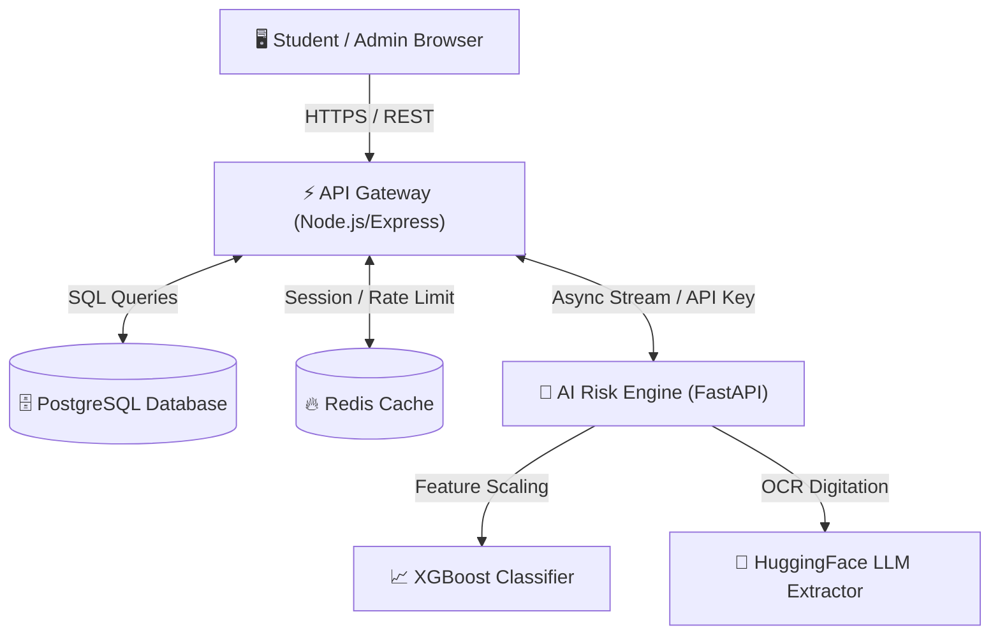

<div align="center">

# 🎓 Credixa | Next-Gen Education BNPL & Autonomous Underwriting

[](https://credixa-8wlw.onrender.com/)
[](https://credixa-backend-7r4k.onrender.com/)
[](https://credixa-risk-engine.onrender.com/)
[](#)
[](#)

<p align="center">
  <b>A comprehensive, state-of-the-art Buy Now Pay Later (BNPL) financial ecosystem for students.</b><br>
  Featuring real-time college verifications, OCR document digitization, and predictive creditworthiness assessments via bank statement analysis.
</p>

</div>

---

## 🌐 Live Cloud Ecosystem

Credixa is deployed globally across a highly scalable 5-pillar cloud microservice architecture:

| Service Pillar | Live URL / Endpoint | Technology | Status |
| :--- | :--- | :--- | :---: |
| **🖥️ React Frontend** | [credixa-8wlw.onrender.com](https://credixa-8wlw.onrender.com/) | React 19, Vite, Tailwind CSS | 🟢 **ONLINE** |
| **⚡ API Gateway** | [credixa-backend-7r4k.onrender.com](https://credixa-backend-7r4k.onrender.com/) | Node.js, Express, JWT | 🟢 **ONLINE** |
| **🧠 AI Risk Engine** | [credixa-risk-engine.onrender.com](https://credixa-risk-engine.onrender.com/) | Python, FastAPI, XGBoost, LLM | 🟢 **ONLINE** |
| **🗄️ Database Vault** | Managed Render DB (`credixa_db`) | PostgreSQL 16 | 🟢 **ONLINE** |
| **🔥 Session Cache** | Managed Render Redis | Redis 7 Alpine | 🟢 **ONLINE** |

---

## 🏛️ System Architecture



---

## ✨ Key Platform Features

### 🎒 For Students & Co-Applicants
* **⚡ Instant 5-Step Onboarding Workflow:** Register educational institution details, select financing semesters, and input co-borrower credentials seamlessly.
* **📂 Intelligent Document Vault:** Upload academic mark sheets, fee structures, and bank statements with automated OCR validation.
* **📈 Real-Time Credit Scoring:** AI evaluation of non-traditional indicators (savings rate, academic performance, DTI ratio, gambling flags) to compute a proprietary **Omniscore**.
* **🗓️ Transparent Repayment Schedules:** Automated amortization schedules with clear installment breakdowns and zero hidden fees.

### 🏛️ For Educational Institutions & Admins
* **🔐 Partner Portal:** Dedicated dashboard to monitor student enrollments, pending disbursements, and active BNPL credit lines.
* **📋 Verification Engine:** Approve or query student academic documents directly through digitized records.
* **🛡️ Fraud Scrutiny:** Immutable audit logs tracking every state change, document upload, and login attempt.

---

## 🚀 Getting Started (Local Development)

Launch the entire 5-pillar ecosystem on your local machine with a single Docker command.

### Prerequisites
* [Docker Desktop](https://www.docker.com/products/docker-desktop/) (v4.0+)
* [Git](https://git-scm.com/)

### 1️⃣ Clone & Configure
```bash
git clone https://github.com/mdkamranalam/credixa.git
cd credixa

# Copy gateway environment defaults
cp backend-gateway/.env.example backend-gateway/.env
```

### 2️⃣ One-Click Container Launch
```bash
docker-compose up --build
```
*This automatically orchestrates PostgreSQL (`:5432`), Redis (`:6379`), Node Gateway (`:3000`), FastAPI Risk Engine (`:8000`), and Vite UI (`:5173`).*

### 3️⃣ Access Local Portals
* **Frontend Portal:** `http://localhost:5173`
* **API Gateway Health:** `http://localhost:3000/health`
* **AI Engine Swagger UI:** `http://localhost:8000/docs`

---

## ☁️ One-Click Cloud Deployment (Render)

Credixa supports automated Infrastructure-as-Code (IaC) deployment via Render Blueprints.

1. Fork this repository to your GitHub account.
2. Log into [Render Dashboard](https://dashboard.render.com/).
3. Click **New +** ➔ **Blueprint**.
4. Connect your GitHub repository. Render will automatically detect [`render.yaml`](file:///render.yaml) and provision all 5 cloud pillars with zero manual configuration.

---

## 🔒 Security & Compliance Protocols

* **🔐 API Key Mandate:** Inter-service ML requests between Gateway and Risk Engine are strictly authenticated via `x-api-key` headers.
* **🛡️ Universal CORS Whitelisting:** Gateway middleware dynamically verifies incoming origins against authorized cloud subdomains.
* **📇 Resilient OCR Fallbacks:** Zero-failure document digitization pipeline with intelligent local heuristics.
* **📦 Secret Management:** Zero hardcoded database strings or private keys in repository commits.

---

<div align="center">
  <b>Built with ❤️ for Financial Inclusion & Accessible Education.</b>
</div>