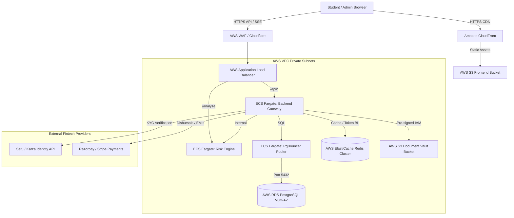

# Credixa AWS Cloud-Native Production Architecture

This document defines the highly available, secure cloud infrastructure topology for deploying Credixa in production.

---

## 1. Networking & Edge Security

- **Amazon CloudFront**: Caches static assets (`/assets/*`, `.js`, `.css`) with HTTP/3 and Brotli compression enabled.
- **AWS WAF**: Mounted on the ALB. Blocks rate-limit violations (>100 req/min per IP), SQL injection payloads, and bad bot traffic.
- **VPC Subnetting**: ALB resides in Public Subnets (IGW attached). ECS Fargate containers, RDS PostgreSQL, and ElastiCache reside strictly in Private Subnets with NAT Gateway egress for external fintech API requests.

## 2. Stateful Services (Managed Layer)

### Database: Amazon RDS PostgreSQL 16
- **Instance**: `db.t4g.medium` or `db.r6g.large` (Multi-AZ deployment enabled).
- **Storage**: gp3 SSD with storage autoscaling.
- **Backups**: Automated daily snapshots with 14-day retention and Point-in-Time Recovery (PITR) down to the second.
- **Pooling**: Routed via **PgBouncer** container sidecar or dedicated Fargate task (`POOL_MODE=transaction`) to support up to 2,000 concurrent student connections without Postgres OOM.

### Caching & Session: Amazon ElastiCache Redis 7
- **Cluster**: Multi-node replication group with automatic failover.
- **Persistence**: AOF (Append Only File) configured `everysec` to preserve rate limiter counters and blacklisted JWT `jti` tokens across node restarts.

### Document Vault: Amazon S3 Private Bucket
- **Encryption**: SSE-KMS managed keys.
- **Access Control**: Public access blocked 100%. Accessed exclusively via `@aws-sdk/s3-request-presigner` generating temporary URLs with 15-minute TTL.

## 3. CI/CD & Zero-Downtime Rolling Deployments

Deployments are executed via GitHub Actions (`.github/workflows/production-deploy.yml`):
1. **Quality Gates**: Node.js automated unit tests and Python AST syntax verification.
2. **Container Registry**: Builds immutable Docker tags keyed by git commit SHA pushed to Amazon ECR.
3. **Orchestration**: AWS ECS updates service task definitions with `minimumHealthyPercent: 100` and `maximumPercent: 200`, ensuring zero dropped active user connections or broken SSE streams during rollouts.
